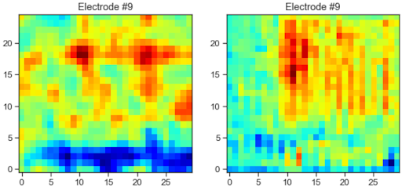
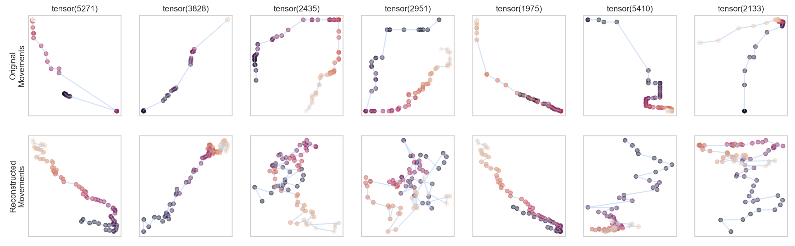
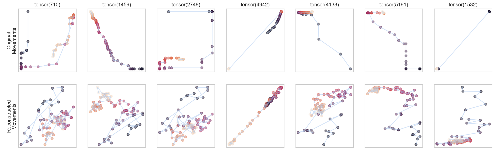

# Contents
 - The bigger picture 🌌
 - [Dataset 🧠](#Dataset)
 - Step 1: Decoding movements
   - [Decoding movements](#decoding-movements)
   - [Decoding hand](#keras-to-pytorch-oh-my)
   - [Decoding movement angle](#decoding-movement-angle)
 - Step 2: Build low-dimensional representations
   - [Low-dimensional representation of ECoG data](#)
   - [Low-dimensional representation of behavioral data](#vae-for-reaches)
 - Step 3: [Decode low-dimensional representations of behavior from ECoG data](#reconstruction-based-on-dncnn-predictions)

# Bigger picture

A number of authors have recently suggested that we should look at the mesoscale dynamics of brain to disentangle specific movements (e.g., Natraj et al., 2022).

Can movements be encoded in the brain via low-dimensional latent space variables?

   

# Dataset
Datasets are available [here](https://dandiarchive.org/dandiset/000055/0.220127.0436/files?location=). Supporting paper: [link](https://www.nature.com/articles/s41597-022-01280-y)

Code to view and to open the data is available [here](https://github.com/BruntonUWBio/ajile12-nwb-data).

   

   <i>Figure taken from: Peterson, S.M., Singh, S.H., Dichter, B. et al. AJILE12: Long-term naturalistic human intracranial neural recordings and pose. Sci Data 9, 184 (2022)</i>

## Decoding movements

Using the [dataset](https://figshare.com/projects/Generalized_neural_decoders_for_transfer_learning_across_participants_and_recording_modalities/90287) from [this paper](https://iopscience.iop.org/article/10.1088/1741-2552/abda0b) it is possible to solve movement/no-movement classification task. The corresponding jupyter-notebook can be found at [./models/Baseline-Classification-Model](./models/Baseline-Classification-Model). Over 95% accuracy was achieved on spectral features, suggesting their importance for decoding movements.

## Time-frequency autoencoder

> 'Is it possible to infer low-dimensional space describing spectral dynamics in the brain? 🤔

We tried to construct an encoder-decoder network based on time-frequency features. Later the encoder part of this network could be used in any ECoG-behavior task. However, one sample for training such network is of `shape = (n_channels, n_freqs, n_times)`, yielding a very high-dimensional input vector. This figure shows hope for constructing a decent time-frequency autoencoder, but it struggles with generalization and even correct representation of input matrices:

   

The PCA, fully-connected and deep convolutional autoencoders for squeezing high-dimensional time-frequency data can be found at [`\models\Handmade-TF-Autoencoder\`](./models/Handmade-TF-autoencoder).
Further development is based on the idea that deep convolutional autoencoder is not able to learn due to gradient vanishing and underfitting.

## Keras to Pytorch, Oh My!

One of our ideas for the project was wrist prediction based on ECoG time-frequency spectrograms. The authors of the [paper](https://www.sciencedirect.com/science/article/abs/pii/S0165027021001345) once used [HTNet](https://github.com/BruntonUWBio/HTNet_generalized_decoding/blob/e0058d4bc67a95a59e4a51384d895d0d07c4d65b/htnet_model.py) structure for a similar task and programmed it in Keras. We reproduced the HTNet model, which refers to one of the ConvNets developed by the creators of the dataset, using which we obtained high performance in binary classification according to several metrics. This task introduced a bit of struggle because we had to transfer initial Keras code to PyTorch, bearing in mind that PyTorch lacks individual functions for Depthwise and Separable convolutions. See code [here](./models/wrist_classification/NMA_Wrist_Classification.ipynb).

## Decoding movement angle

The authors of the [paper](https://www.sciencedirect.com/science/article/abs/pii/S0165027021001345) extracted so-called "reach" events and their corresponding features, such as displacement, duration, polynomial approximation and angle. We hypothesised that angle can be predicted using time-frequency features. However, this was not the case. It is possible that noise from the motion-capture system and lack of 3d-reconstruction of movements made it impossible to extract reasonable features. We highly doubt that behavioral time series possess a lot of sense without normalization and smoothing. 

## VAE for Reaches

The goal of this step of our analysis was to compress movement trajectories into low-dimensional space. At the first glance, this supposed to be a trivial task, so we quickly built autoencoder and plugged the raw coordinates of the movement into it. And it did not work for all movements. See code [here](./models/reach_ae/train_ae_for_raw_reaches.ipynb).

   

   <i>Movement reconstruction using linear autoencoder with the latent space = 10.</i>

  

   <i>Movement reconstruction using linear autoencoder with the latent space = 4.</i>

  

   <i>Examples of preprocessed movements.</i>

   

   <i>Examples of the VAE reconstructions.</i>

What the latent space encodes? 🤔

   

   <i>Examples of decoder reconstructions based on different values of latent variables.</i>

## Reconstruction based on DnCNN predictions

   

   <i>Pipeline of movement low-dimensional representation reconstruction from ECoG</i>

   

   <i>Movement reconstruction from the decoded latent space values</i>

**Team:** Antonenkova Yuliya, [Chirkov Valerii](https://github.com/vagechirkov), Latyshkova Alexandra, [Popkova Anastasia](https://github.com/popkova-a), [Timchenko Alexey](https://github.com/AlexeyTimchenko)

**TA:** [Kuzmina Ekaterina](https://github.com/NevVerVer)

**Project TA:** Xiaomei Mi

**Mentor:** Mousavi Mahta

# Literature

1. Natraj, N., Silversmith, D. B., Chang, E. F., & Ganguly, K. (2022). Compartmentalized dynamics within a common multi-area mesoscale manifold represent a repertoire of human hand movements. Neuron, 110(1), 154-174.e12. https://doi.org/10.1016/j.neuron.2021.10.002
2. Peterson, S. M., Singh, S. H., Dichter, B., Scheid, M., Rao, R. P. N., & Brunton, B. W. (2022). AJILE12: Long-term naturalistic human intracranial neural recordings and pose. Scientific Data, 9(1), 184. https://doi.org/10.1038/s41597-022-01280-y
3. Peterson, S. M., Steine-Hanson, Z., Davis, N., Rao, R. P. N., & Brunton, B. W. (2021). Generalized neural decoders for transfer learning across participants and recording modalities. Journal of Neural Engineering, 18(2), 026014. https://doi.org/10.1088/1741-2552/abda0b
4. Peterson, S. M., Singh, S. H., Wang, N. X. R., Rao, R. P. N., & Brunton, B. W. (2021). Behavioral and Neural Variability of Naturalistic Arm Movements. ENeuro, 8(3), ENEURO.0007-21.2021. https://doi.org/10.1523/ENEURO.0007-21.2021
5. Singh, S. H., Peterson, S. M., Rao, R. P. N., & Brunton, B. W. (2021). Mining naturalistic human behaviors in long-term video and neural recordings. Journal of Neuroscience Methods, 358, 109199. https://doi.org/10.1016/j.jneumeth.2021.109199
6. Pailla, T., Miller, K. J., & Gilja, V. (2019). Autoencoders for learning template spectrograms in electrocorticographic signals. Journal of Neural Engineering, 16(1), 016025. https://doi.org/10.1088/1741-2552/aaf13f
7. Higgins, I., Matthey, L., Pal, A., Burgess, C., Glorot, X., Botvinick, M., Mohamed, S., & Lerchner, A. (2022, July 21). beta-VAE: Learning Basic Visual Concepts with a Constrained Variational Framework. https://openreview.net/forum?id=Sy2fzU9gl

 
