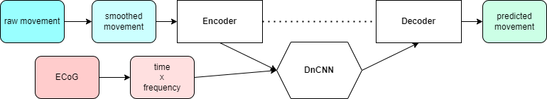

# Contents
 - The bigger picture 🌌
 - [Dataset 🧠](#Dataset)
 - Step 1: Decoding movements
   - [Decoding movements](#)
   - [Decoding hand](#)
   - [Decoding movement angle](#)
 - Step 2: Build low-dimensional representations
   - [Low-dimensional representation of ECoG data](#)
   - [Low-dimensional representation of behavioral data](#vae-for-reaches)
 - Step 3: [Decode low-dimensional representations of behavior from ECoG data](#reconstruction-based-on-dncnn-predictions)

# Bigger picture

Can movements be coded in the brain in low-dimensional latent space?

# Dataset
Datasets are available [here](https://dandiarchive.org/dandiset/000055/0.220127.0436/files?location=).

Code to view and to open the data is available [here](https://github.com/BruntonUWBio/ajile12-nwb-data).

## VAE for Reaches

Examples of preprocessed movements:

Examples of the VAE reconstructions:

What the latent space encodes? 🤔

## Reconstruction based on DnCNN predictions

**Team:** Antonenkova Yuliya, [Chirkov Valerii](https://github.com/vagechirkov), Latyshkova Alexandra, [Popkova Anastasia](https://github.com/popkova-a), [Timchenko Alexey](https://github.com/AlexeyTimchenko)

**TA:** [Kuzmina Ekaterina](https://github.com/NevVerVer)

**Project TA:** Xiaomei Mi

**Mentor:** Mousavi Mahta

# Literature

1. Peterson, S. M., Singh, S. H., Dichter, B., Scheid, M., Rao, R. P. N., & Brunton, B. W. (2022). AJILE12: Long-term naturalistic human intracranial neural recordings and pose. Scientific Data, 9(1), 184. https://doi.org/10.1038/s41597-022-01280-y
2. Peterson, S. M., Steine-Hanson, Z., Davis, N., Rao, R. P. N., & Brunton, B. W. (2021). Generalized neural decoders for transfer learning across participants and recording modalities. Journal of Neural Engineering, 18(2), 026014. https://doi.org/10.1088/1741-2552/abda0b
3. Peterson, S. M., Singh, S. H., Wang, N. X. R., Rao, R. P. N., & Brunton, B. W. (2021). Behavioral and Neural Variability of Naturalistic Arm Movements. ENeuro, 8(3), ENEURO.0007-21.2021. https://doi.org/10.1523/ENEURO.0007-21.2021
4. Singh, S. H., Peterson, S. M., Rao, R. P. N., & Brunton, B. W. (2021). Mining naturalistic human behaviors in long-term video and neural recordings. Journal of Neuroscience Methods, 358, 109199. https://doi.org/10.1016/j.jneumeth.2021.109199
5. Pailla, T., Miller, K. J., & Gilja, V. (2019). Autoencoders for learning template spectrograms in electrocorticographic signals. Journal of Neural Engineering, 16(1), 016025. https://doi.org/10.1088/1741-2552/aaf13f
6. Higgins, I., Matthey, L., Pal, A., Burgess, C., Glorot, X., Botvinick, M., Mohamed, S., & Lerchner, A. (2022, July 21). beta-VAE: Learning Basic Visual Concepts with a Constrained Variational Framework. https://openreview.net/forum?id=Sy2fzU9gl

 